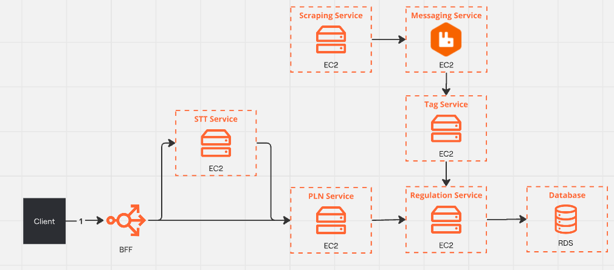

# pond-m07-s06

# Implementação de Arquitetura em Nuvem com VPC, API Gateway e Monitoramento

## Introdução

Nos dias de hoje, sistemas conversacionais enfrentam desafios crescentes de segurança devido à sua exposição direta à internet e à manipulação de dados sensíveis. Esses sistemas processam informações importantes, como voz e textos que podem conter dados pessoais, o que exige uma infraestrutura que garanta a proteção contra ataques e violações de privacidade. De acordo com estudos recentes, a segurança de aplicações baseadas em nuvem está diretamente relacionada ao uso de técnicas de isolamento de redes, auditoria de atividades e monitoramento contínuo (SHACKLEFORD, 2021). Por isso, é crucial implementar uma arquitetura que considere esses aspectos, isolando componentes críticos e monitorando o tráfego e as atividades dentro do sistema. O uso de serviços de monitoramento, como CloudTrail e CloudWatch, combinados com redes privadas (VPCs), é amplamente reconhecido como uma solução eficaz para mitigar vulnerabilidades (AMAZON, 2023).

O problema abordado nesta proposta é a necessidade de reforçar a segurança de um sistema conversacional que utiliza serviços de processamento de linguagem natural (PLN) e reconhecimento de voz (STT) em uma arquitetura de nuvem. Atualmente, o sistema apresenta exposição de todos os serviços à internet, o que aumenta o risco de acessos indevidos e ataques de negação de serviço (DDoS), além da ausência de mecanismos eficazes de auditoria e monitoramento. Assim, propõe-se uma nova arquitetura que visa mitigar esses problemas, fortalecendo a segurança e garantindo maior controle sobre os dados e atividades.

## Comparação da Arquitetura Anterior e Nova

### Arquitetura Anterior
Na arquitetura original, todos os serviços estavam expostos diretamente à internet, e não havia segregação entre componentes públicos e privados. Isso tornava o sistema vulnerável a uma série de ataques e violações de segurança. Além disso, faltavam mecanismos robustos de auditoria e monitoramento, o que dificultava a identificação de acessos indevidos ou comportamentos anômalos. A imagem abaixo ilustra essa arquitetura:

**Principais Características da Arquitetura Anterior:**
- **Serviços expostos à internet**: Todos os serviços (como STT Service, PLN Service, Scraping Service e Tag Service) eram acessíveis diretamente da internet, aumentando o risco de ataques.
- **Ausência de isolamento de rede**: Não havia segregação entre sub-redes pública e privada, o que comprometia a segurança dos dados.
- **Falta de monitoramento eficiente**: Não havia a implementação de CloudTrail para auditoria de chamadas de API, nem CloudWatch para monitoramento contínuo de logs.

### Nova Arquitetura
A nova arquitetura introduz várias melhorias de segurança e controle, com o uso de uma **VPC** (Virtual Private Cloud) dividida em sub-redes pública e privada. Serviços críticos foram movidos para a sub-rede privada, tornando-os inacessíveis diretamente da internet. Além disso, a integração de **CloudTrail** e **CloudWatch** permite um monitoramento constante e auditoria de todas as ações e chamadas de API.

**Principais Características da Nova Arquitetura:**
- **VPC com sub-redes pública e privada**: Os serviços foram segregados, com aqueles que precisam de acesso à internet (como o BFF e STT Service) na sub-rede pública, enquanto os serviços internos (Scraping, Tag, Regulation e Database) foram movidos para a sub-rede privada.
- **Isolamento de Serviços**: Serviços sensíveis, como o **Regulation Service** e o **Database**, agora só podem ser acessados por serviços internos, protegendo-os de ataques externos.
- **Monitoramento e Auditoria**: O **CloudTrail** registra todas as chamadas de API e ações realizadas no sistema, enquanto o **CloudWatch** permite a monitoração contínua dos logs e alerta para comportamentos anômalos ou falhas.

### Comparação de Mudanças
- **Exposição de Serviços**: Na arquitetura anterior, todos os serviços eram diretamente acessíveis. Agora, apenas os componentes que precisam de interação direta com o usuário final, como o **API Gateway** e o **STT Service**, estão na sub-rede pública. Os serviços internos, como o **Scraping Service**, **Tag Service**, **PLN Service** e **Database**, estão isolados em uma sub-rede privada, protegidos de acessos externos.
  
- **Monitoramento**: Anteriormente, a falta de monitoramento dificultava a identificação de acessos suspeitos. A nova arquitetura implementa **CloudTrail** e **CloudWatch**, garantindo uma visibilidade total de todas as atividades do sistema e a capacidade de responder rapidamente a qualquer comportamento anômalo.

- **Auditoria**: Com a implementação de **CloudTrail**, todas as chamadas de API são registradas, possibilitando auditoria detalhada de todas as ações, enquanto a arquitetura anterior não permitia esse nível de controle.

## Solução Proposta

A proposta de solução inclui a reorganização da arquitetura do sistema em uma VPC (Virtual Private Cloud) dividida em duas sub-redes: pública e privada, de forma a isolar os serviços que não precisam de acesso à internet. A seguir, apresento o diagrama da nova arquitetura:

### Descrição dos Módulos:

1. **API Gateway**: Atua como ponto de entrada seguro para o sistema, responsável pelo roteamento de todas as requisições dos clientes. Ele garante que apenas as chamadas autorizadas cheguem aos serviços internos.
2. **BFF (Backend for Frontend)**: Intermediário entre o cliente e os outros serviços, organizando as requisições e repassando os dados necessários para os serviços de PLN e STT. Localizado na sub-rede pública, ele é o único componente, além do API Gateway, exposto à internet.
3. **STT (Speech to Text) Service**: Converte o áudio recebido em texto para processamento pelo PLN Service. Apesar de estar na sub-rede pública, o acesso é restrito ao BFF.
4. **Scraping Service**: Responsável por coletar dados de fontes regulatórias. Localizado na sub-rede privada, acessa a internet através de uma NAT Gateway para coletar informações externas.
5. **PLN (Processamento de Linguagem Natural) Service**: Processa o texto gerado pelo STT Service e realiza o tagueamento e a classificação das informações, retornando resultados para o Regulation Service.
6. **Tag Service**: Organiza as tags ou rótulos extraídos dos documentos, facilitando a categorização e a pesquisa futura.
7. **Regulation Service**: Faz a gestão dos documentos normativos, permitindo a busca e visualização pelo cliente, com base nas tags fornecidas.
8. **Database (RDS)**: Armazena de forma segura os dados processados e os documentos regulatórios, acessível apenas pelos serviços na sub-rede privada.

Além disso, foram integrados o **CloudTrail** e o **CloudWatch Logs**, conectando todos os serviços da arquitetura. O **CloudTrail** registra todas as atividades e chamadas de API, garantindo rastreabilidade e auditoria das operações. O **CloudWatch Logs** é responsável por monitorar e gerar alertas em tempo real com base nos logs de eventos, permitindo a identificação de problemas de forma proativa.

## Conclusão

A implementação desta nova arquitetura trará um nível significativo de segurança e controle sobre o sistema conversacional, garantindo a privacidade e integridade dos dados processados. O isolamento dos serviços críticos em uma sub-rede privada reduz o risco de ataques cibernéticos, enquanto o uso de API Gateway, CloudTrail e CloudWatch aumenta a capacidade de monitoramento e auditoria do sistema. A implementação dessa solução exige um esforço moderado, especialmente na configuração e testes de conectividade entre as sub-redes pública e privada, além da integração correta dos serviços de monitoramento. Entretanto, os benefícios em termos de segurança e confiabilidade justificam amplamente o investimento em tempo e recursos para a migração para essa nova arquitetura.

## Referências Bibliográficas

AMAZON. **AWS CloudTrail Documentation**. Disponível em: https://docs.aws.amazon.com/cloudtrail/. Acesso em: 15 set. 2024.

SHACKLEFORD, D. **Security in the Cloud: Best Practices for Securing AWS Workloads**. Tech Publishing, 2021.
